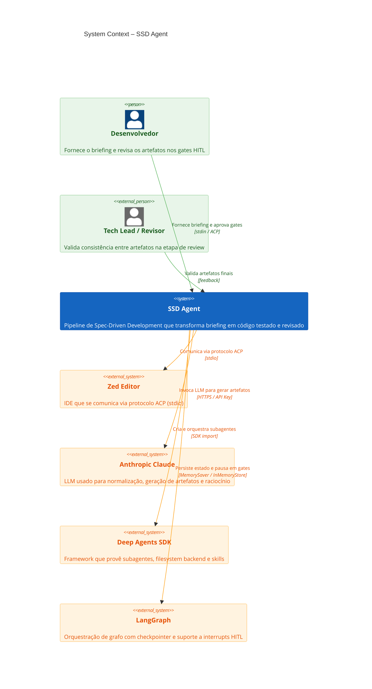

# SSD Agent — Nível 1 (System Context)

> Visão macro: atores humanos, o sistema principal e sistemas externos.

## Diagrama

## Elementos

| Alias | Tipo | Descrição |
|-------|------|-----------|
| `dev` | Person | Desenvolvedor que inicia o pipeline com um briefing e responde aos gates HITL |
| `reviewer` | Person_Ext | Tech Lead que valida a consistência final dos artefatos |
| `ssd` | System | O sistema SSD Agent — pipeline completo de briefing → código |
| `zed` | System_Ext | Editor Zed que se integra via protocolo ACP |
| `anthropic` | System_Ext | API da Anthropic (Claude) usada como motor de IA |
| `deepagents` | System_Ext | SDK que provê subagentes especializados, filesystem backend e skills |
| `langgraph` | System_Ext | Framework de orquestração com checkpointer e interrupt mechanism |

## Paleta de Cores

| Elemento | Cor | Significado |
|----------|-----|-------------|
| Pessoas (dev, reviewer) | Verde (#4caf50) | Atores humanos que interagem com o sistema |
| SSD Agent (sistema central) | Azul (#1565c0) | Sistema principal sendo descrito |
| Sistemas externos | Laranja (#ff9800) | Dependências externas necessárias |
