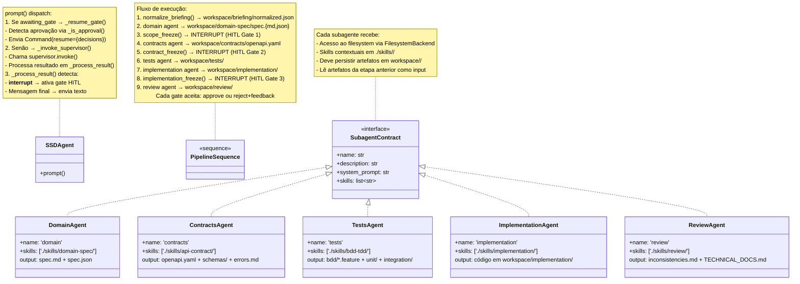

# SSD Agent — Nível 4 (Code Diagram)

> Visão granular: classe/interface para representar o nível de código.

## Diagrama Principal — Classes e Relacionamentos

```mermaid
classDiagram
    direction TB

    %% ── ACP SDK Base ──
    class Agent {
        <<abstract>>
        +on_connect(conn)
        +initialize()
        +new_session()
        +prompt()
    }

    %% ── ACP Bridge ──
    class SSDAgent {
        -_conn: Client
        -_sessions: dict~str, dict~
        +on_connect(conn: Client)
        +initialize(protocol_version, clientCapabilities, clientInfo) InitializeResponse
        +new_session(cwd, mcp_servers, session_id) NewSessionResponse
        +prompt(prompt, session_id, message_id) PromptResponse
        -_send(session_id, text)
        -_invoke_supervisor(message, session_id, state, config) PromptResponse
        -_resume_gate(user_response, session_id, state, config) PromptResponse
        -_process_result(result, session_id, state) PromptResponse
    }

    %% ── Pydantic Schemas ──
    class GateInput {
        +resumo: str
        +artefato_path: str
    }

    class BriefingInput {
        +briefing_bruto: str
    }

    class NormalizedBriefing {
        +objetivo: str
        +escopo: list~str~
        +nao_escopo: list~str~
        +usuarios: list~str~
        +regras_de_negocio: list~str~
        +restricoes_tecnicas: list~str~
        +riscos: list~str~
        +perguntas_em_aberto: list~str~
        +model_dump_json()
    }

    class Entidade {
        +nome: str
        +atributos: list~str~
        +invariantes: list~str~
    }

    class CasoDeUso {
        +nome: str
        +ator: str
        +descricao: str
        +fluxo_principal: list~str~
        +excecoes: list~str~
        +criterios_de_aceite: list~str~
    }

    class DomainSpec {
        +contexto: str
        +glossario: dict~str, str~
        +entidades: list~Entidade~
        +eventos: list~str~
        +politicas: list~str~
        +casos_de_uso: list~CasoDeUso~
        +criterios_de_aceite_globais: list~str~
    }

    class EndpointContract {
        +metodo: str
        +path: str
        +descricao: str
        +request_schema: str
        +response_schema: str
        +erros: list~str~
    }

    class ContractManifest {
        +endpoints: list~EndpointContract~
        +schemas: list~str~
        +erros_catalogados: list~str~
    }

    class CenarioBDD {
        +feature: str
        +cenario: str
        +dado: list~str~
        +quando: list~str~
        +entao: list~str~
    }

    class TestManifest {
        +cenarios_bdd: list~CenarioBDD~
        +arquivos_tdd: list~str~
        +cobertura_por_regra: dict~str, list~str~~
    }

    %% ── CLI ──
    class CLI {
        <<module>>
        +main()
        +run(briefing, thread_id)
        -_is_approval(text) bool
        -_print_separator(label)
        -_extract_last_message(result) str
    }

    %% ── Supervisor Module ──
    class SupervisorModule {
        <<module>>
        +supervisor
        +create_supervisor()
        -_checkpointer: MemorySaver
        -_store: InMemoryStore
        -_WORKSPACE: Path
    }

    %% ── Gate Tools ──
    class GateTools {
        <<module>>
        +scope_freeze(resumo, artefato_path) str
        +contract_freeze(resumo, artefato_path) str
        +implementation_freeze(resumo, artefato_path) str
        +normalize_briefing(briefing_bruto) str
    }

    %% ── Subagents ──
    class SubagentsModule {
        <<module>>
        +ALL_SUBAGENTS: list~dict~
        +DOMAIN_AGENT: dict
        +CONTRACTS_AGENT: dict
        +TESTS_AGENT: dict
        +IMPLEMENTATION_AGENT: dict
        +REVIEW_AGENT: dict
    }

    %% ── Helper Functions ──
    class AgentHelpers {
        <<module>>
        +_is_approval(text) bool
        +_extract_feedback(text) str
        +_extract_last_ai_message(result) str
        +_handle_exception(exc_type, exc_value, exc_tb)
        +main()
    }

    %% ── Relationships ──
    Agent <|-- SSDAgent : extends

    SSDAgent ..> SupervisorModule : invokes
    SSDAgent ..> AgentHelpers : uses
    SSDAgent ..> GateInput : processes

    SupervisorModule ..> GateTools : registers as tools
    SupervisorModule ..> SubagentsModule : configures subagents
    SupervisorModule ..> NormalizedBriefing : structured output

    GateTools ..> GateInput : args_schema
    GateTools ..> BriefingInput : args_schema
    GateTools ..> NormalizedBriefing : creates & persists

    DomainSpec *-- Entidade : contains
    DomainSpec *-- CasoDeUso : contains

    ContractManifest *-- EndpointContract : contains

    TestManifest *-- CenarioBDD : contains

    CLI ..> SupervisorModule : invokes
    CLI ..> AgentHelpers : shares _is_approval

    note for SSDAgent "ACP Bridge — expõe o pipeline SSD como agente compatível com Zed. Gerencia sessões, gates HITL e streaming de respostas."
    note for SupervisorModule "Orquestra o pipeline: briefing → domain → contracts → tests → implementation → review com 3 gates HITL"
    note for SubagentsModule "5 subagentes especializados: domain, contracts, tests, implementation, review"
```

## Diagrama Detalhado — Fluxo Interno e Subagentes

## Legenda

| Símbolo | Significado |
|---------|-------------|
| `class` | Classe Python concreta |
| `<<abstract>>` | Classe base abstrata (ACP SDK) |
| `<<module>>` | Módulo Python (funções + variáveis de módulo) |
| `<<interface>>` | Contrato conceitual (dict com chaves fixas) |
| `*--` | Composição (contém e gerencia o ciclo de vida) |
| `..>` | Dependência (importa ou invoca) |
| `<|--` | Herança (extends) |
